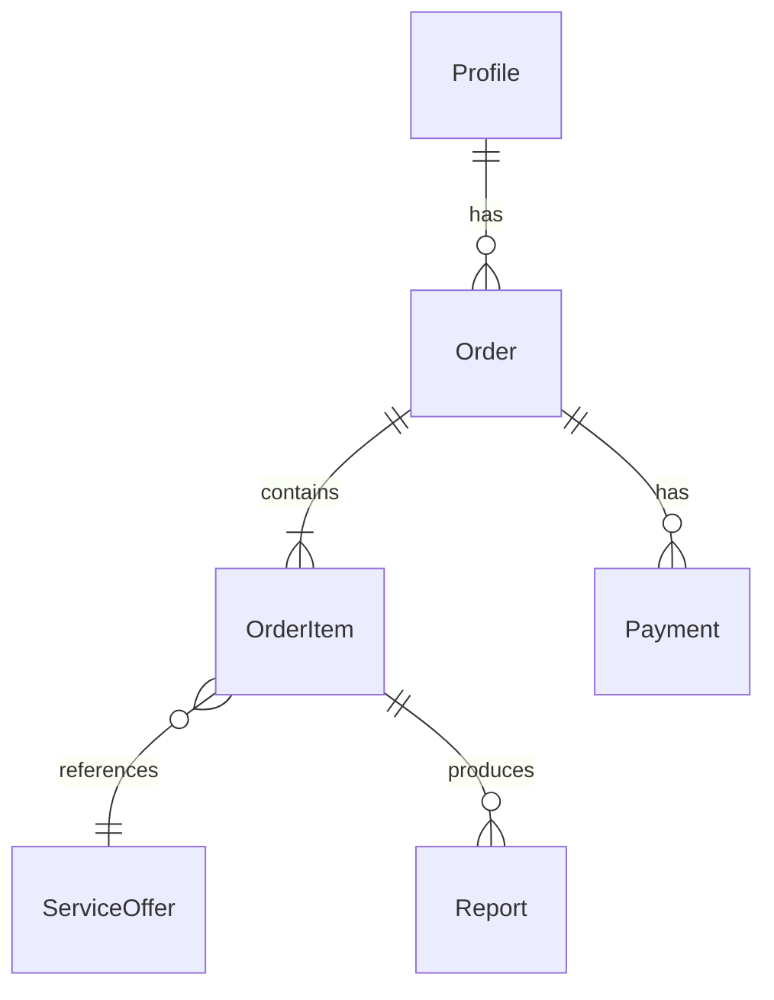
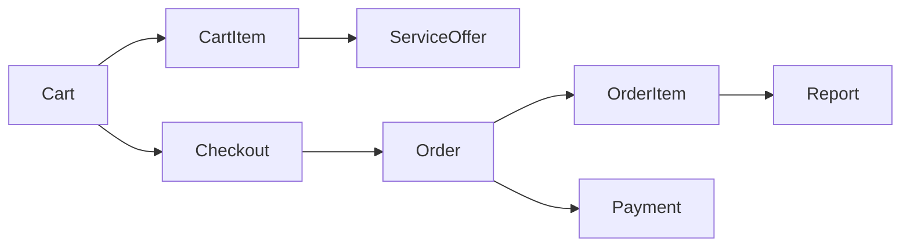

# VIN-платформа (БазаБаза) — доменная модель и наставничество

**Статус:** основной учебный + коммерческий трек. Старый сценарий (регистрация на события) в `homework/` — **архив**, формат обучения тот же.

**Источники:** `Сайт.docx` (корень репо), [макет Figma — главная desktop](https://www.figma.com/design/lH5KkodmwnpGfS3pv1SzFD/Vin-%D0%BE%D1%82%D1%87%D0%B5%D1%82?node-id=0-1&p=f&t=GE8LqutHt0BrDXGD-0), [цепочка API (Google Sheets)](https://docs.google.com/spreadsheets/d/1XMaa4ime6GRpaHGWuVBZxS6OzGMP6Itk8Oz_puXxkXc/edit?gid=0#gid=0).

**Код:** `projects/vin-platform/` — отдельное Laravel-приложение. **Уроки:** [homework/README.md](./homework/README.md). Общие собес-модули **07–14** остаются в корневом `homework/`.

Код пишет ученик; наставник ведёт по шагам.

---

## Структура репозитория

| Путь | Назначение |
|------|------------|
| `homework/00–06` | Архив: сценарий «события» (не удаляем) |
| `homework/07–14` | Собесы — **общие**, параллельно VIN |
| `projects/vin-platform/` | **Код VIN-платформы** (нулевой Laravel) |
| `projects/vin-platform/homework/` | Уроки **00–15** под VIN (полный ТЗ) |
| `projects/vin-platform/DOMAIN.md` | Этот файл |

Корневой Laravel (`/app`, `/routes` в корне mentorship) — **откатить к нулевому** (см. [README.md](./README.md)); учебный код только в `projects/vin-platform/`.

---

## Разделы ЛК vs сущности в БД

| Раздел в ЛК | Сущности | Комментарий |
|-------------|----------|-------------|
| Мой профиль | `users` + `profiles` | ФИО, телефон — в **`profiles`** |
| **Отчёты** | `reports` | Готовые PDF, не заказы |
| **Заказы** (было «Оплаты/Финансы») | `orders` + `payments` | Коммерция + статус обработки |
| Служба поддержки | `support_tickets` + `support_messages` | [урок 09](./homework/09-support-tickets.md) |
| Гараж | `vehicles` | [урок 08](./homework/08-garage.md) |

---

## Связь заказов и отчётов



| Связь | Кардинальность | Смысл |
|--------|----------------|--------|
| `Order` → `OrderItem` | 1 : N | Заказ; в MVP часто одна позиция |
| `OrderItem` → `Report` | 1 : N | **Одна покупка оффера → один или несколько отчётов/файлов** |
| `Order` → `Report` | через items | `hasManyThrough` |

**Жизненный цикл:** `pending_payment` → оплата → `paid` → Job на `OrderItem` → `Report(s): processing → completed/failed` → `Order: completed`.

Отчёт создаётся **после оплаты**, не вместе с заказом.

---

## Один оффер — несколько документов/отчётов?

**Да, может.** Это разные уровни:

| Уровень | Пример | В БД |
|---------|--------|------|
| **Оффер (каталог)** | Пакет «Премиум»: VIN + штрафы + залог | В админке: состав оффера (`offer_includes` / JSON `document_types`) |
| **Покупка (OrderItem)** | Пользователь купил «Премиум» по VIN `XTA…` | Одна позиция заказа |
| **Результат (Report)** | 2 PDF или 2 записи `reports` | `OrderItem` **hasMany** `Report` |

**Рекомендация для MVP:**

- В ЛК в разделе «Отчёты» показывать **каждый `Report`** (или группировать по заказу — UI-решение).
- Поле `reports.type`: `vin`, `fines`, `gibdd`, …
- Поле `reports.file_path` — один PDF на запись.
- Пакет «Стандарт» → **1 Report**; «Премиум» → **N Reports** по составу оффера.

Альтернатива (позже): одна запись `Report` + таблица `report_files` — если всегда одна «карточка» в UI с несколькими вложениями.

---

## Сущности

| Модель | Связи | Заметка |
|--------|-------|---------|
| `User` | auth | email для входа |
| `Profile` | `user` 1:N (сейчас 1:1) | ФИО, телефон; soft delete + анонимизация |
| `Service` | каталог | «VIN-отчёт», «Штрафы ГИБДД»… |
| `ServiceOffer` | `service` 1:N | Пакет, цена, состав документов — **из админки** |
| `Order` | `profile`, `items` | Статусы заказа |
| `OrderItem` | `order`, `offer`, input (VIN/GRZ/STS), price snapshot | |
| `Payment` | `order` | Paykeeper, идемпотентный webhook |
| `Report` | `order_item` | PDF, `type`, статус |
| `Vehicle` | `profile` | Гараж |
| `SupportTicket` | `profile` | Поддержка |

**Не тащить Bitrix «инфоблок + SKU» дословно** — смысл тот же: `Service` + `ServiceOffer`.

### Каталог: Service без Offer

| Ситуация | Поведение |
|----------|-----------|
| `Service` без офферов | Только черновик в админке / «Скоро» — **не показывать как купить** |
| `Service` в каталоге (активная) | **Минимум 1 Offer** — иначе некуда ссылаться в `OrderItem` |
| `Service` с одним оффером | Можно скрыть выбор пакета — покупается этот Offer |
| `Service` с несколькими офферами | Пользователь выбирает пакет → в корзину идёт **Offer** |

**Правило:** `OrderItem` всегда ссылается на `service_offer_id`. Услуга без оффера — только витрина.

### Корзина (до заказа)



| Модель | Назначение |
|--------|------------|
| `Cart` | **1:1 с `profile`** (`profile_id` unique) — одна корзина на профиль |
| `CartItem` | `service_offer_id`, `input_type`, `input_value`, количество (обычно 1) |

Checkout: `Cart` → один `Order` + N `OrderItem` + один `Payment` на сумму заказа.

**Решение (п.7):** основной сценарий в продукте — **корзина**. Кнопка «Купить сейчас» в UI — не отдельная логика, а **ярлык**: добавить один Offer в корзину и открыть `/cart` (или сразу checkout). В БД всё равно `Cart` → `Order`.

В [уроке 03](./homework/03-orders-paykeeper-queue-integrations.md) — **учебный** пропуск корзины (одна позиция сразу в `Order`), чтобы сначала отработать Paykeeper и Job. В [уроке 07](./homework/07-cart-checkout.md) корзина становится **основным** путём; прямой `Order` из 03 убирается или сводится к shortcut.

#### Пример: Иван (корзина → заказ)

**Каталог**

| Service | Offer | Цена |
|---------|-------|------|
| VIN-отчёт | Стандарт | 499 ₽ |
| VIN-отчёт | Премиум (VIN + штрафы) | 999 ₽ |
| Штрафы ГИБДД | Разовая | 199 ₽ |
| Проверка залога | — | «Скоро» |

**1. Корзина (черновик)** — Иван ещё не оформил:

1. Выбрал Offer **«Премиум»**, VIN `XTA…` → «В корзину» → `cart_items.service_offer_id = Премиум`
2. Выбрал Offer **«Штрафы разовая»**, ГРЗ `А123БВ777` → «В корзину»

```text
cart_items: 2 строки, сумма 1198 ₽
orders / payments / reports — ЕЩЁ НЕТ (можно удалить строку, закрыть сайт)
```

**2. Заказ (сделка)** — «Оформить заказ»:

```text
orders:       id=100, total=1198, status=pending_payment
order_items:  2 строки (Премиум 999 + Штрафы 199), price_snapshot зафиксирован
cart_items:   очищены
payments:     после Paykeeper 1198 ₽, status=paid
reports:      после Job — по document_types каждого оффера
```

**Не в корзину:** «Проверка залога» без Offer — кнопки «В корзину» нет.

### Хранение PDF

| Среда | Диск | Поля в `reports` |
|-------|------|------------------|
| local dev | `local` | `file_disk`, `file_path` |
| staging / **prod (MVP)** | **`local` на VPS** | скачивание через Laravel `download()` |
| позже | S3 / Yandex Object Storage | [урок 11](./homework/11-storage-s3.md) — опционально при росте |

Бэкап: БД + `storage/app/reports` на отдельное хранилище (урок 15).

---

## Решения по ТЗ (зафиксировано)

### Продукт / MVP

| # | Решение |
|---|---------|
| **1** | **Несколько услуг** с первого релиза; обязательно **VIN-отчёт с офферами** (пакеты). Остальные услуги — карточки на главной; полный pipeline — по мере уроков. |
| **2** | **Только после регистрации** (Breeze). Гостевой checkout — не делаем. |
| **3** | Состав VIN-пакетов и цены — **в админке (Filament)**. |

### Профиль и 152-ФЗ

| # | Решение |
|---|---------|
| **4** | ПДн в **`profiles`** (не дублировать в `users` кроме email для auth). |
| **5** | Удаление: **soft delete** + **анонимизация** (ФИО → «Удалён», телефон null, основание — запрос субъекта). |
| **16** | Нужны **политика обработки ПДн** и **основания обработки** (согласие при регистрации / договор при покупке). В dev — только тестовые VIN. |

### Деньги

| # | Решение |
|---|---------|
| **6** | **Тестовый кабинет Paykeeper** + webhooks на staging. |
| **7** | **Корзина** — основной путь; несколько Offer → один `Order` → один `Payment`. **Обе кнопки** на странице оффера: «В корзину» и «Купить сейчас» (заказчик). «Купить сейчас» = shortcut в корзину (см. пример выше). |
| **8** | **Два типа тарифов:** (1) по **дням** — доступ на 7/30+ дней; (2) по **количеству** — N отчётов. Могут сочетаться — [урок 14](./homework/14-subscriptions-tariffs.md). |

### Отчёты и API

| # | Решение |
|---|---------|
| **9** | Цепочка API: [Google Sheets](https://docs.google.com/spreadsheets/d/1XMaa4ime6GRpaHGWuVBZxS6OzGMP6Itk8Oz_puXxkXc/edit?gid=0#gid=0). В коде — **`config/integrations.php`**: порядок провайдеров, fallback (например API CLOUD → Tronk для штрафов). Таблица в Sheets — источник правды для настройки; при расхождении правим конфиг. |
| **10** | Отчёт — **PDF**. Хранение: **`local` на VPS** (10b); S3 — позже при необходимости. |
| **16b** | Отчёт в ЛК: **1 год** с даты получения заказа (готовый отчёт). |
| **11** | **DaData:** в `Сайт.docx` §4.2.2 есть, в [цепочке VIN](https://docs.google.com/spreadsheets/d/1XMaa4ime6GRpaHGWuVBZxS6OzGMP6Itk8Oz_puXxkXc/edit?gid=0#gid=0) — нет. **MVP не подключаем.** Цепочка VIN: Tronk, SpectrumData, API CLOUD. Частичный PDF — да. |

**Провайдеры из цепочки (Sheets):** Tronk, SpectrumData, API CLOUD; ветвления по типу ввода (VIN / GRZ / STS).

### Админка и фронт

| # | Решение |
|---|---------|
| **12** | **Filament** — каталог услуг/офферов, заказы (read-only на старте). |
| **13** | **Blade + Tailwind** (Breeze). |

### Репозиторий

| # | Решение |
|---|---------|
| **14–15** | `homework/` в корне **сохраняем** (архив events + собесы 07–14). Код VIN — **`projects/vin-platform/`**. Корневой Laravel — **нулевой**. |

---

## Термины и вопросы

- **Глоссарий** (Paykeeper, webhook, Breeze, Filament, Job, pipeline…): [GLOSSARY.md](./GLOSSARY.md)
- **Открытые вопросы:** [QUESTIONS.md](./QUESTIONS.md) · **для заказчика:** [QUESTIONS_FOR_CLIENT.md](./QUESTIONS_FOR_CLIENT.md)

Закрыто: п.2 (только регистрация), п.7 (корзина), п.8 (тарифы: дни + количество), UI «Заказы», DaData вне MVP.

### Как работают тарифы (п.8)

Две **независимые** механики (могут быть оба продукта на `/tariffs`):

| Тип | Пример | В БД | Проверка при заказе |
|-----|--------|------|---------------------|
| **По дням** | «30 дней безлимит VIN» | `tariff_plans.duration_days`, `profile_tariffs.ends_at` | `now() < ends_at` |
| **По количеству** | «10 отчётов любых услуг» | `tariff_plans.report_quota`, `profile_tariffs.reports_remaining` | `reports_remaining > 0`, после заказа `--` |

Разовые покупки через **Offer** в корзине — как сейчас; тариф **уменьшает цену до 0** или списывает 1 из квоты. **Автопродление в MVP нет.** Детали — [урок 14](./homework/14-subscriptions-tariffs.md).

**Главная:** все услуги из ТЗ — карточки; рабочий E2E сначала **только VIN** ([QUESTIONS.md](./QUESTIONS.md) §1b).

---

## Паттерны с примерами

### 1. Интеграции `App\Integrations\*` + очередь на заказ

**Идея:** HTTP к Tronk/DaData не в контроллере. После оплаты — **Job**, внутри — **пайплайн** по конфигу.

```
Paykeeper webhook → Order paid → dispatch GenerateReportsJob(orderItem)
    → ReportPipeline
        → TronkClient::vinToGrzSts()
        → ApiCloudClient::fines()  // fail → TronkClient::fines()
        → PdfBuilder → storage → Report completed
```

**Структура папок (пример):**

```
app/Integrations/
    Contracts/ProviderClient.php
    Tronk/TronkClient.php
    ApiCloud/ApiCloudClient.php
    Pipeline/ReportPipeline.php
app/Jobs/GenerateReportsJob.php
```

**Job (упрощённо):**

```php
// app/Jobs/GenerateReportsJob.php
public function handle(ReportPipeline $pipeline): void
{
    $this->orderItem->reports()->where('status', 'processing')->each(
        fn (Report $report) => $pipeline->run($this->orderItem, $report)
    );
}
```

**Пайплайн читает конфиг:**

```php
// config/integrations.php
'vin_premium' => [
    'input' => ['vin', 'grz', 'sts'],
    'steps' => [
        ['provider' => 'tronk', 'method' => 'resolveIdentifiers'],
        ['provider' => 'api_cloud', 'method' => 'fines', 'fallback' => ['tronk', 'fines']],
    ],
    'reports' => ['vin', 'fines'], // сколько Report создать на OrderItem
],
```

Аналогия с уроком 03 (events): там после POST регистрации уходил `SendRegistrationNotification` — здесь после **оплаты** уходит `GenerateReportsJob`, чтобы не держать пользователя 30–60 сек на HTTP.

---

### 2. Идемпотентность webhook Paykeeper

**Проблема:** Paykeeper может прислать **один и тот же** webhook **2–5 раз** (ретраи, таймаут). Без защиты: дважды списали логически, дважды запустили Job, два отчёта.

**Решение:** обработать платёж **ровно один раз** по уникальному id из Paykeeper.

```php
// app/Http/Controllers/PaykeeperWebhookController.php
public function __invoke(Request $request): Response
{
    $paymentId = $request->input('id'); // id платежа в Paykeeper
    $orderId   = $request->input('orderid');

    $payment = Payment::firstOrCreate(
        ['paykeeper_id' => $paymentId],
        ['order_id' => $orderId, 'amount' => $request->input('sum'), 'status' => 'pending']
    );

    if ($payment->wasRecentlyCreated === false && $payment->status === 'paid') {
        return response('OK'); // уже обработали — молча 200
    }

    if (!$this->paykeeper->verifySignature($request)) {
        abort(403);
    }

    DB::transaction(function () use ($payment, $orderId) {
        $payment->update(['status' => 'paid', 'paid_at' => now()]);

        $order = Order::lockForUpdate()->findOrFail($orderId);
        if ($order->status !== 'paid') {
            $order->update(['status' => 'paid']);
            $order->items->each(fn ($item) => $this->dispatchReports($item));
        }
    });

    return response('OK');
}
```

**Ключи:** `paykeeper_id` **unique** в `payments`; проверка «уже paid»; `lockForUpdate` на заказ; Job dispatch только при первом переходе в `paid`.

---

### 3. Feature flags — провайдеры по одному

**Идея:** не подключать все API сразу. В `.env` / `config/integrations.php` включаешь провайдера, когда готов ключ и клиент.

```env
INTEGRATION_TRONK_ENABLED=true
INTEGRATION_API_CLOUD_ENABLED=false
INTEGRATION_SPECTRUM_ENABLED=false
```

```php
// config/integrations.php
'providers' => [
    'tronk' => [
        'enabled' => env('INTEGRATION_TRONK_ENABLED', false),
        'base_url' => env('TRONK_API_URL'),
        'api_key' => env('TRONK_API_KEY'),
    ],
    'api_cloud' => [
        'enabled' => env('INTEGRATION_API_CLOUD_ENABLED', false),
        ...
    ],
],
```

```php
// ReportPipeline — пропуск выключенных
foreach ($steps as $step) {
    if (!config("integrations.providers.{$step['provider']}.enabled")) {
        Log::info("Skip disabled provider: {$step['provider']}");
        continue;
    }
    $this->runStep($step);
}
```

**Зачем на обучении:** сначала **fake/stub** провайдер → зелёный E2E без денег на API; потом `TRONK_ENABLED=true` на staging; потом API CLOUD. На собесе: «постепенный rollout, меньше риска сломать прод».

---

## Программа уроков (00–15)

### Фаза 1 — ядро (рабочий E2E)

| Урок | Тема | Покрытие ТЗ |
|------|------|-------------|
| [00](./homework/00-local-environment.md) | Нулевой Laravel | Окружение |
| [01](./homework/01-domain-migrations-policies.md) | Домен, миграции, Policy | User, Profile, Service, Offer, Order, Report |
| [02](./homework/02-breeze-catalog-filament.md) | Breeze, главная, Filament | Каталог, ЛК-оболочка, админка услуг |
| [03](./homework/03-orders-paykeeper-queue-integrations.md) | «Купить сейчас», Paykeeper, Job, stub API | Заказ, оплата, очередь, PDF |
| [04](./homework/04-feature-tests.md) | Feature-тесты | Критичный путь |
| [05](./homework/05-docker-compose.md) | Docker + worker | Инфра |
| [06](./homework/06-deploy-readme-privacy.md) | Staging, README, 152-ФЗ | Политика ПДн, первый деплой |

**Контрольная точка фазы 1:** VIN end-to-end на staging, три раздела ЛК (профиль, заказы, отчёты).

### Фаза 2 — коммерция и ЛК (полный ТЗ)

| Урок | Тема | Покрытие ТЗ |
|------|------|-------------|
| [07](./homework/07-cart-checkout.md) | Корзина, checkout, несколько позиций | Корзина → один Order → один Payment |
| [08](./homework/08-garage.md) | Гараж | `vehicles`, VIN из гаража в заказ |
| [09](./homework/09-support-tickets.md) | Поддержка | Тикеты, переписка, статусы |
| [10](./homework/10-integrations-live.md) | Живые API | Tronk, API CLOUD, SpectrumData, частичный PDF |
| [11](./homework/11-storage-s3.md) | S3, signed URLs | Хранение отчётов на проде |
| [12](./homework/12-filament-operations.md) | Filament ops | Заказы, отчёты, retry, логи интеграций |
| [13](./homework/13-api-sanctum.md) | API `/api/v1` | Sanctum, каталог, заказы, отчёты |
| [14](./homework/14-subscriptions-tariffs.md) | Тарифы 7/30 дней | Подписка или пакеты доступа |
| [15](./homework/15-production-guest-refunds.md) | Прод-готовность | Гостевой checkout*, возвраты, мониторинг |

\*Гостевой checkout — ветка в уроке 15; решение по п.2 фиксируется перед реализацией.

### Параллельно (корень репо)

Собесы **07–14** — [homework/](../../homework/README.md) (нумерация **отдельная** от VIN 07–15; идут параллельно с любого урока кода).

### Соответствие разделам ЛК

| Раздел ЛК | Уроки |
|-----------|--------|
| Профиль | 01, 02, 06, 15 |
| Заказы | 03, 07, 12 |
| Отчёты | 03, 10, 11 |
| Гараж | 08 |
| Поддержка | 09 |
| Тарифы (7/30) | 02 (ссылка), 14 |
| Админка | 02, 12 |
| API партнёрам | 13 |

---

## Демо и персональные данные

Коммерческий продукт в dev/staging:

- не вводить **реальные** VIN с привязкой к владельцу, паспорт, телефоны;
- политика ПДн и основания обработки — **обязательны** на проде (урок 06);
- на формах — чекбокс согласия со ссылкой на политику.
