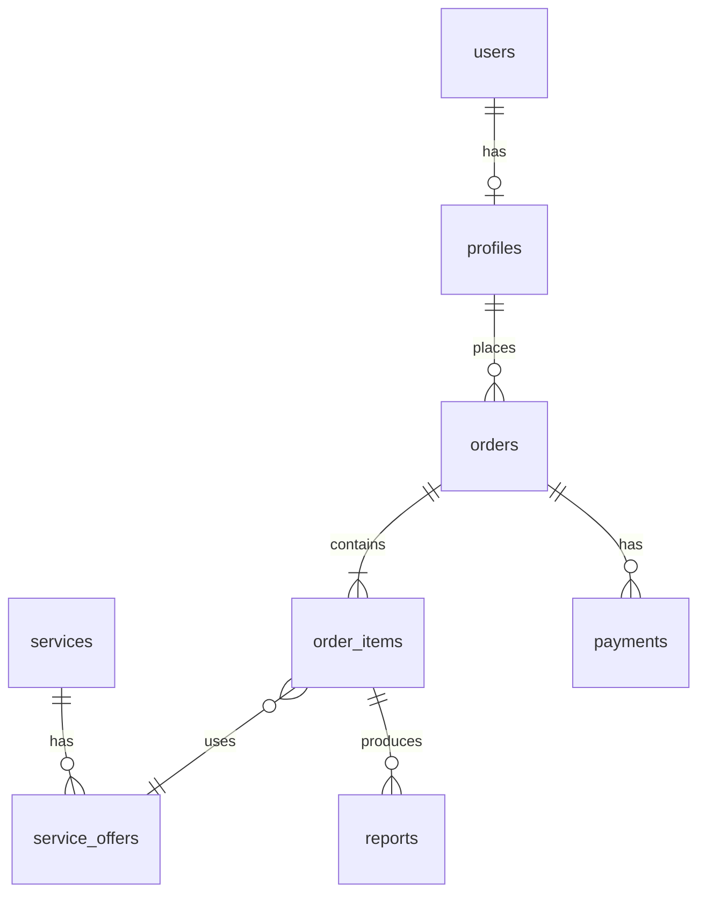

# ERD — VIN-платформа (заполняет ученик)

**Урок 01, шаг 0.** Не копировать готовую схему наставника — нарисовать **свою** и сдать на проверку.

## Инструмент (на выбор)

- [dbdiagram.io](https://dbdiagram.io) (DBML) — удобно для сдачи
- [draw.io](https://app.diagrams.net/) / FigJam / Miro
- Mermaid в этом файле (ниже — только каркас)

## Фаза A — ядро (сдать до миграций в уроке 01)

Обязательные сущности:

- `users`, `profiles` (1 user → 1 profile в MVP)
- `services`, `service_offers`
- `orders`, `order_items`, `payments`, `reports`

На схеме указать:

- первичные ключи;
- внешние ключи;
- кардинальность (1:N, 1:1);
- 3–5 важных полей на таблицу (не обязательно все).

**Проверь себя:**

- [ ] `OrderItem` ссылается на **Offer**, не на Service
- [ ] `Report` связан с `OrderItem` (1:N)
- [ ] `Payment` связан с `Order`



*Замени/дополни своей диаграммой. Это каркас, не финал.*

## Фаза B — тарифы (урок 14)

Ответ заказчика зафиксирован в [QUESTIONS.md §0](../QUESTIONS.md). **Дополни** ERD перед миграциями урока 14:

```text
tariff_plans
  - service_id          # привязка к услуге (VIN, штрафы…)
  - type: quota         # только пакеты по количеству; duration — нет
  - name, price
  - report_quota        # 5, 10, 50…

profile_tariffs
  - profile_id, tariff_plan_id
  - reports_remaining
  - status              # active | depleted
```

**Правила:** 1 заказ по услуге = −1 квота; любой Offer этой услуги = 1 единица. Несколько активных `profile_tariffs` — по разным `service_id`.

Также при необходимости: `carts`, `cart_items` (урок 07); `vehicles`, `support_tickets` (уроки 08–09).

## Сдача наставнику

1. Ссылка на dbdiagram / PNG / PDF **или** Mermaid/DBML в этом файле.
2. 5–10 предложений: путь «корзина → заказ → оплата → отчёт» по **твоим** таблицам.
