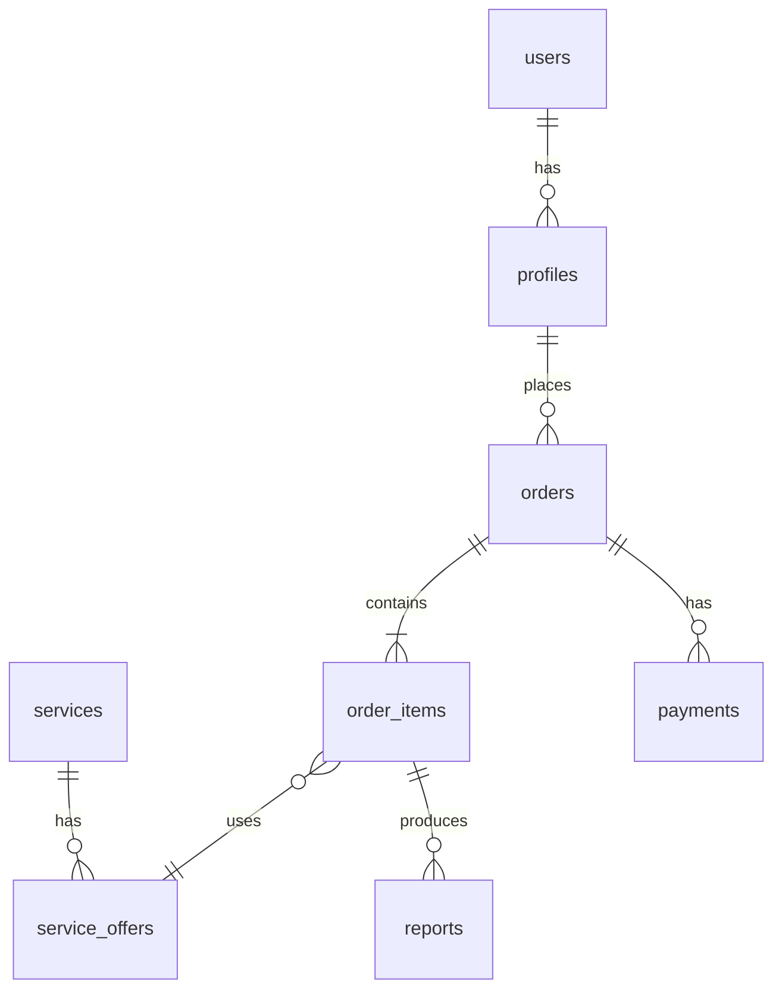

# Урок 01 — Домен: миграции, модели, политики

**Цель:** **сначала ERD своими руками**, потом миграции; модели и **ProfilePolicy**.

См. [DOMAIN.md](../DOMAIN.md) — ориентир, не копипаста. Шаблон: [docs/ERD.md](../docs/ERD.md).

## Задание (сдать наставнику)

- [ ] **Шаг 0 (до кода):** ER-диаграмма **фазы A** (ядро) — файл [docs/ERD.md](../docs/ERD.md) или ссылка на dbdiagram.io. **Сдать наставнику до шага 1.**
- [ ] **Шаг 1:** миграции по **своей** схеме (список ниже — сверка, не обязан совпасть 1:1); `php artisan migrate`.
- [ ] **Шаг 2:** модели + связи; tinker: `$user->profiles`, `$offer->service`, `$orderItem->reports`.
- [ ] **Шаг 3:** `ProfilePolicy` (view/update/delete только свои).
- [ ] **Шаг 4:** soft delete на `profiles`; черновик метода анонимизации (пока без UI удаления).
- [ ] **Собес:** §15 (нормализация), §9 (SRP) — устно.
- [ ] `TIME_LOG`.

## Перед ДЗ

- [DOMAIN.md](../DOMAIN.md), [TARIFFS_EXPLAINED.md](../TARIFFS_EXPLAINED.md) — смысл сущностей
- [Migrations](https://laravel.com/docs/migrations), [Soft Deletes](https://laravel.com/docs/eloquent#soft-deleting)
- Урок **00** сдан
- Локальная разработка: MySQL на Mac ниже (как на staging VPS — не SQLite)

## Техника

### Окружение — MySQL на Mac (Homebrew)

**Зачем:** миграции урока 01 (JSON, FK, enum/string) ведут себя как на сервере. Staging остаётся на VPS; локально — своя БД в `.env` (не коммитить).

**Папка проекта:**

```bash
cd ~/Projects/laravel-mentorship/projects/vin-platform
```

#### 1. MySQL

```bash
brew install mysql
brew services start mysql
mysql --version
```

Проверка, что сервер запущен:

```bash
brew services list | grep mysql
# mysql — started
```

#### 2. PHP + расширение для MySQL

Нужны PHP **8.3+** и `pdo_mysql`:

```bash
php -v
php -m | grep pdo_mysql
```

Если `pdo_mysql` нет:

```bash
brew install php@8.3
brew link php@8.3 --force --overwrite
php -m | grep pdo_mysql
```

#### 3. База и пользователь (как на VPS, пароль свой)

```bash
mysql -u root
```

```sql
CREATE DATABASE vin_platform CHARACTER SET utf8mb4 COLLATE utf8mb4_unicode_ci;
CREATE USER 'vin'@'localhost' IDENTIFIED BY 'СМЕНИ_ПАРОЛЬ';
GRANT ALL ON vin_platform.* TO 'vin'@'localhost';
FLUSH PRIVILEGES;
EXIT;
```

Проверка входа:

```bash
mysql -u vin -p vin_platform
# EXIT;
```

#### 4. Laravel — зависимости и `.env`

```bash
cd ~/Projects/laravel-mentorship/projects/vin-platform
composer install
cp .env.example .env   # если .env ещё нет
php artisan key:generate
```

В **`.env`** (локально):

```env
APP_ENV=local
APP_DEBUG=true
APP_URL=http://127.0.0.1:8000

DB_CONNECTION=mysql
DB_HOST=127.0.0.1
DB_PORT=3306
DB_DATABASE=vin_platform
DB_USERNAME=vin
DB_PASSWORD=СМЕНИ_ПАРОЛЬ
```

```bash
php artisan migrate        # стандартные таблицы Laravel — OK
php artisan test
php artisan serve
```

В браузере: http://127.0.0.1:8000 — стартовая Laravel.

#### 5. Полезные команды

| Задача | Команда |
|--------|---------|
| Остановить MySQL | `brew services stop mysql` |
| Запустить снова | `brew services start mysql` |
| Сбросить БД (осторожно) | `php artisan migrate:fresh` |
| Синхрон с сервером | `git pull` в `projects/vin-platform` |

**Не путать:** `.env` на Mac ≠ `.env` на `/var/www/vin-platform`. Секреты и `APP_URL` у каждого окружения свои.

**Критерий:** `php artisan migrate` и `php artisan test` локально — зелёные до шага 1 (свои миграции фазы A).

---

### Шаг 0 — ERD (Entity-Relationship Diagram)

**Что это:** схема сущностей БД и связей (таблицы, ключи, 1:N). Не код — **картина** до миграций.

**Что можно нарисовать без ответа заказчика (фаза A):**  
`users` → `profiles` → `orders` → `order_items` → `reports`, `payments`, `services` → `service_offers`.

**Что отложить (фаза B, урок 14):** таблицы **тарифов и пакетов** — после [QUESTIONS_FOR_CLIENT §0](../QUESTIONS_FOR_CLIENT.md). На фазе A достаточно пометки «tariff_* — позже».

**Инструмент:** [dbdiagram.io](https://dbdiagram.io) или [docs/ERD.md](../docs/ERD.md).

**Критерий сдачи шага 0:**

- диаграмма есть;
- `OrderItem` → `service_offer_id`, не `service_id`;
- `Report` → несколько на один `OrderItem` (если оффер с несколькими типами PDF);
- короткий текст: как заказ превращается в отчёт.

**Только после OK наставника на ERD** — шаг 1 (миграции).

### Шаг 1 — миграции (порядок)

1. **`profiles`** — `user_id`, `first_name`, `last_name`, `phone` (nullable), `timestamps`, `softDeletes`
2. **`services`** — `slug` unique, `name`, `description`, `is_active`, `sort_order`
3. **`service_offers`** — `service_id`, `slug`, `name`, `price` (unsigned), `document_types` (json: `["vin","fines"]`), `is_active`
4. **`orders`** — `profile_id`, `status` (enum/string), `total_amount`, `timestamps`
5. **`order_items`** — `order_id`, `service_offer_id`, `input_type` (vin/grz/sts), `input_value`, `price_snapshot`, `timestamps`
6. **`payments`** — `order_id`, `paykeeper_id` **unique** nullable, `amount`, `status`, `paid_at` nullable
7. **`reports`** — `order_item_id`, `type` (vin/fines/…), `status`, `file_path` nullable, `meta` json nullable

*Позже (отдельные уроки):* `vehicles` — [08](08-garage.md); `support_tickets` — [09](09-support-tickets.md); `carts` — [07](07-cart-checkout.md).



### Шаг 2 — модели

- `Profile`: `belongsTo User`, `hasMany Order`
- `Service`: `hasMany ServiceOffer`
- `ServiceOffer`: `belongsTo Service`, cast `document_types` → array
- `Order`: `belongsTo Profile`, `hasMany OrderItem`, `hasMany Payment`
- `OrderItem`: `belongsTo Order`, `belongsTo ServiceOffer`, **`hasMany Report`**
- `Report`: `belongsTo OrderItem`

### Шаг 3 — Policy

`ProfilePolicy::view/update/delete` — `$profile->user_id === $user->id`.

### Шаг 4 — анонимизация (черновик)

Метод `Profile::anonymize()`: обнулить phone, заменить ФИО, `deleted_at`. Основание — 152-ФЗ, UI в уроке 06.

**Критерий:** tinker — два пользователя, чужой профиль `can('view')` → false.

## Следующий урок

[02 — Breeze, каталог, Filament](02-breeze-catalog-filament.md)

---

## Справочник

> [100 вопросов](../../../interview/100-questions-middle.md) §9, §15. [DOMAIN.md](../DOMAIN.md) — несколько Report на один OrderItem.
